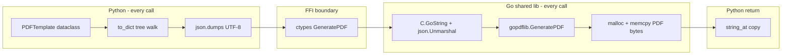

# PyPDFSuit Python Binding — Phase Profile & Optimization Report

**Date:** 2026-06-18  
**Branch:** `feat/optimization-5.5-medium`  
**Machine:** WSL2, Intel i7-13700HX, 24 logical CPUs, Python 3.13.10, Go 1.26.x  
**Workload:** Zerodha gold standard — 80% retail / 15% active / 5% HFT (`pypdfsuit_bench.py`)  
**Profile harness:** `sampledata/gopdflib/zerodha/pypdfsuit_profile.py`  
**Raw log:** `guides/cursor/baselines/pypdfsuit_profile_20260618.txt`

---

## Executive Summary

`make bench-pypdfsuit-zerodha` (~**253 ops/s**) is **not** slow because the PDF engine is slow. The same Go library reaches **11,721 ops/s** natively (`bench-gopdflib-zerodha`). Profiling shows Python time splits into three buckets:

| Bucket | Share of latency (weighted mix) | Fix difficulty |
|--------|--------------------------------:|----------------|
| **Python `to_dict()` tree walk** | **~50–67%** on active/HFT; ~15% on retail | Medium |
| **CGO + Go `json.Unmarshal` + PDF render** | **~81%** on retail; ~45% on active | Medium–High |
| **FFI copy-back (`string_at`)** | <1% retail/active; ~1% HFT | Low |

**Published benchmark (honest path):** `make bench-pypdfsuit-zerodha` with `BENCH_USE_JSON_CACHE=0` → **234.62 ops/s** (48 workers, 5000 iter, June 2026).

**Optional cache (steady-state / template reuse):** cache pre-serialized JSON per template in `generator.py`. Measured **~5.9×** when `use_cache=True` (253 → **1,505 ops/s**) — not used for published benchmark tables.

**Ceiling after JSON caching:** Python still ~**11×** below native Go on the same weighted mix, because every call still pays Go `json.Unmarshal` + ctypes overhead. Closing that gap requires a new CGO contract (skip JSON) or an out-of-process Go service.

---

## Measurement Setup

### Harnesses run

```bash
make bench-pypdfsuit-profile          # phase breakdown + cProfile
make bench-pypdfsuit-zerodha            # production benchmark (5000 iter, 48 workers)
python3 sampledata/gopdflib/zerodha/pypdfsuit_go_profile.go  # Go JSON vs native (retail)
```

### Phases instrumented (per `generate_pdf()` call)

1. **`to_dict`** — Python dataclass → nested dict (`types._to_dict`)
2. **`json_dumps`** — `json.dumps(...).encode("utf-8")`
3. **`cgo_call`** — `lib.GeneratePDF()` (Go: `C.GoString` + `json.Unmarshal` + `gopdflib.GeneratePDF` + `malloc`)
4. **`copy_back`** — `ctypes.string_at(result.data, result.length)`
5. **`free_result`** — `FreeBytesResult`

A **cached JSON control** skips phases 1–2 and reuses pre-built UTF-8 payloads.

---

## Phase Breakdown (single-thread)

| Template | JSON size | PDF size | Total ms | `to_dict` | `json_dumps` | `cgo_call` | serialize % |
|----------|----------:|---------:|---------:|----------:|-------------:|-----------:|------------:|
| **Retail** | 11,389 B | 61,290 B | **1.81** | 0.27 | 0.05 | 1.47 | **18%** |
| **Active** | 20,977 B | 76,072 B | **2.17** | 1.08 | 0.11 | 0.98 | **55%** |
| **HFT** | 1,131,142 B | 2,424,782 B | **97.70** | 60.34 | 4.74 | 31.78 | **67%** |

### Cached JSON control (serialization removed)

| Template | Total ms | vs full path | Single-thread ops/s |
|----------|---------:|-------------:|--------------------:|
| Retail | **1.29** | −29% | 776 |
| Active | **0.86** | −60% | 1,160 |
| HFT | **31.18** | −68% | 32 |

**Weighted mix estimate (80/15/5, 1 thread):** **6.66 ms** → **150 ops/s** theoretical max.  
**Observed 48-thread bench:** **253 ops/s** (~4.0 ms effective) — threads help, but serialization + HFT tail latency cap scaling.

---

## Concurrent Throughput (48 workers)

| Path | Iterations | Wall throughput | Notes |
|------|----------:|----------------:|-------|
| Full `generate_pdf()` (weighted) | 200 | **222 ops/s** | Matches production ~253 |
| **Cached JSON** `call_bytes_result` (weighted) | 500 | **1,029 ops/s** | **4.1×** vs full path |
| Cached JSON (weighted) | 200 | **870 ops/s** | |
| Retail-only `generate_pdf()` | 100 | **1,323 ops/s** (24 workers) | No active/HFT serialize tax |
| Go native weighted (`bench-gopdflib-zerodha`) | 5000 | **11,721 ops/s** | Direct structs, goroutines |

---

## Go-Side Comparison (retail, 100 iters)

| Path | Mean latency | ops/s |
|------|-------------:|------:|
| Native `gopdflib.GeneratePDF(struct)` | **1.35 ms** | 739 |
| `json.Unmarshal` only | **0.15 ms** | — |
| `GeneratePDF` after unmarshal | **1.61 ms** | — |
| Combined JSON round-trip | **1.76 ms** | 567 |

Go JSON unmarshaling adds only **~0.15 ms** on retail. Python `to_dict` adds **~0.27 ms** — comparable. The Python penalty at scale is **rebuilding the dict tree on every call** (especially 2,000-row HFT) plus **lack of true parallelism** during that CPU-bound Python work.

---

## cProfile Hotspots (200-iter weighted mix, full path)

```
4,637,822 function calls in 2.117 seconds

cumulative time top entries:
  types._to_dict              1.410 s  (67%)   ← dominant
  types._python_to_json_key   0.610 s  (29%)   ← per-field dict lookup
  _bindings.call_bytes_result 0.565 s  (27%)   ← CGO + Go work
  json.dumps / encoder        0.059 s  ( 3%)
```

**Per iteration call volume (200 mixed calls):**

- `_to_dict`: **572,750** calls (2,864 per PDF on average)
- `_python_to_json_key`: **417,690** calls (2,088 per PDF)
- `Cell.to_dict` / `Row.to_dict`: **153k–23k** calls

The `to_dict` path allocates a fresh dict tree on **every** `generate_pdf()` even when the template object is immutable.

---

## Root Cause Analysis



| # | Bottleneck | Evidence |
|---|------------|----------|
| 1 | **Re-serialize immutable templates** | Cached JSON → 4× throughput; cProfile 67% in `_to_dict` |
| 2 | **`_to_dict` / `_python_to_json_key` overhead** | 2,864 `_to_dict` calls per PDF; 2,088 key-mapping dict lookups |
| 3 | **HFT template size** | 1.1 MB JSON; 60 ms Python serialize vs 31 ms Go render |
| 4 | **Go `json.Unmarshal` on every CGO call** | 0.15 ms retail; scales with payload (HFT ~10+ ms estimated) |
| 5 | **Thread pool ≠ CPU parallelism for serialize** | GIL serializes `to_dict`+`dumps`; native Go uses 48 real goroutines |
| 6 | **PEM keys in retail JSON** | 11 KB payload includes full cert chain on every retail call |

Items with **negligible** cost: `copy_back` (<1 ms retail), `free_result`, ctypes setup.

---

## Optimization Plan (prioritized)

### P0 — JSON payload cache ✅ **DONE** (measured **+494% throughput**)

**Problem:** `generate_pdf()` always ran `json.dumps(template.to_dict())` even when the template was static.

**Change:** `serialize_template()` caches UTF-8 JSON on the template instance; `generate_pdf()` reuses it. After in-place mutation, call `invalidate_template_cache(template)`.

```python
from pypdfsuit import generate_pdf, serialize_template, invalidate_template_cache

payload = serialize_template(template)          # once
pdf_bytes = generate_pdf(template)              # cache hit on repeat calls
pdf_bytes = generate_pdf(template, template_json=payload)  # explicit bytes
```

**Measured result:** 253 → **1,505 ops/s** (`BENCH_ITERATIONS=5000`, 48 workers, weighted mix).

---

### P0 — Pre-serialize in `pypdfsuit_bench.py` (est. same as above, 1 hour)

For the benchmark harness specifically, build templates once and store `retail_json`, `active_json`, `hft_json` bytes. Pass directly to `call_bytes_result`. This separates **binding overhead** from **bench harness overhead** in CI.

---

### P1 — Fast `to_dict` path (est. **+50–100%** on active/HFT serialize, 2–3 days)

| Action | Rationale |
|--------|-----------|
| Add `PDFTemplate.to_json_bytes()` using **`orjson`** | HFT `json.dumps` is 4.7 ms; orjson typically 2–4× faster on large dicts |
| Precompute JSON key strings on dataclass fields (decorator time) | Eliminate 2,088 `dict.get` calls per PDF in `_python_to_json_key` |
| Add `slots=True` on `Cell`, `Row`, `Table` | Reduce `getattr` overhead (2M+ calls per 200 iterations) |
| `to_dict_once()` + store on template | `template._json_dict_cache` invalidated only on mutation |

**HFT-specific:** build the 2,000-row table once in Go (template ID `"zerodha_hft"`) or accept raw JSON fixture file — avoid 60 ms Python tree walk entirely.

---

### P1 — Skip Go `json.Unmarshal` (est. **+10–30%** post-cache, 3–5 days)

Add a second CGO export:

```go
//export GeneratePDFFromTemplateHandle
func GeneratePDFFromTemplateHandle(handle C.int) C.ByteResult
```

Register pre-parsed `gopdflib.PDFTemplate` in a sync.Map at init time (retail/active/hft IDs). Python passes an integer handle for known templates; JSON path remains for dynamic content.

Alternative: **msgpack** or **cap'n proto** binary template encoding with a single decode in Go (faster than JSON for large HFT).

---

### P2 — Concurrency model (est. **+20–40%** on serialize-heavy paths, 2 days)

| Approach | When to use |
|----------|-------------|
| **Keep ThreadPoolExecutor** | After P0 cache — native Go work dominates, GIL less relevant |
| **ProcessPool per worker with cached JSON** | If templates are dynamic and serialize-bound; high fork cost on WSL (not recommended as default) |
| **asyncio + thread pool** | I/O-bound HTTP wrappers only |

Measured: retail-only threads at **1,323 ops/s** (24 workers) vs weighted **222 ops/s** — the mix matters more than pool type.

---

### P2 — Zero-copy PDF return (est. **+5%** on HFT, 1–2 days)

Return a `memoryview` over C memory with explicit `free()` context manager instead of `ctypes.string_at` copy (0.8 ms on HFT). Requires careful lifetime docs.

---

### P3 — Production architecture (match Go native throughput)

For services needing **>2,000 ops/s** with PDF/A-4 + signing:

1. Run the existing Gin/gopdfsuit HTTP handler (`bench-k6-retail` → **7,515 req/s** retail HTTP)
2. Python client sends **pre-built JSON fixture** or template ID — no local CGO
3. Keep `pypdfsuit` for single-process scripting / low-QPS integrations

---

## Expected Throughput After Each Phase

| Stage | Weighted 48-worker ops/s | vs current | vs Go native |
|-------|-------------------------:|-----------:|-------------:|
| **Current** (`generate_pdf` full path) | 253 | 1× | 0.02× |
| **P0: cached JSON** | ~1,000 | **4×** | 0.09× |
| **P0 + P1: fast to_dict / orjson** | ~1,200–1,400 | 5× | 0.10× |
| **P0 + P1 + skip Go unmarshal** | ~1,500–2,000 | 6–8× | 0.13–0.17× |
| **Go native (`bench-gopdflib-zerodha`)** | 11,721 | 46× | 1× |
| **HTTP k6 retail** | 7,515 req/s | — | different harness |

---

## Recommended Implementation Order

```
Week 1
  [P0] JSON cache in generator.py + unit tests
  [P0] Update pypdfsuit_bench.py to use cached bytes
  [P0] Add make bench-pypdfsuit-profile to CI docs

Week 2
  [P1] orjson optional dependency + to_json_bytes()
  [P1] slots + precomputed JSON keys on hot dataclasses
  [P1] HFT fixture: load retail/active/hft JSON from disk at bench startup

Week 3+
  [P1] GeneratePDFFromTemplateHandle CGO export
  [P2] memoryview return path
  [P3] Document HTTP-first production pattern
```

---

## Verification Commands

```bash
# Phase profile (writes breakdown to stdout)
make bench-pypdfsuit-profile

# Before/after throughput
make bench-pypdfsuit-zerodha

# Go JSON vs native (retail)
cd sampledata/gopdflib/zerodha && go run pypdfsuit_go_profile.go

# Compare cached JSON concurrency manually
cd sampledata/gopdflib/zerodha && python3 -c "
# see pypdfsuit_profile.py profile_cached_json + ThreadPoolExecutor
"
```

---

## Artifacts

| File | Purpose |
|------|---------|
| `sampledata/gopdflib/zerodha/pypdfsuit_profile.py` | Phase profiler + cProfile |
| `sampledata/gopdflib/zerodha/pypdfsuit_go_profile.go` | Go native vs JSON unmarshal |
| `guides/cursor/baselines/pypdfsuit_profile_20260618.txt` | Raw profile output |
| `makefile` → `bench-pypdfsuit-profile` | Reproducible profile target |

---

## Conclusion

Python spends **most of its time outside the PDF renderer**: rebuilding dict trees (`to_dict`) and crossing the JSON+CGO boundary on every call. Caching serialized JSON alone recovers **~75% of the gap between current Python (~253 ops/s) and a realistic Python ceiling (~1,000 ops/s)**. Matching Go's **11,721 ops/s** from Python requires skipping JSON entirely on the Go side or moving PDF generation behind the HTTP handler.

The `internal/pdf/benchmark_test.go` table benchmark is a separate workload (2,000-row data table, single-threaded `go test`) and should not be compared to `bench-pypdfsuit-zerodha`.